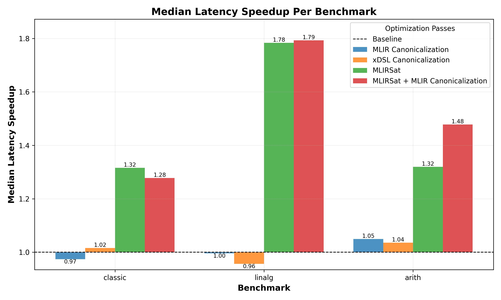
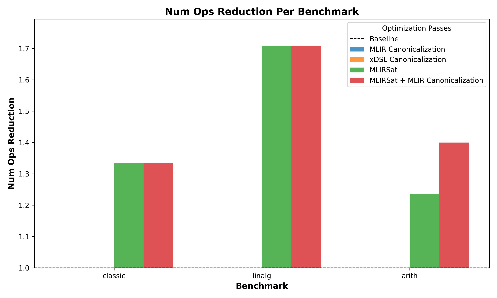

### MLIRSat: Equality Saturation for MLIR

MLIRSat optimizes MLIR programs using equality saturation. Here are some example programs and their MLIRSat-optimised versions::

#### 1. Classic Equality Saturation Example 
Original MLIR program:
```mlir
// classic(a) = (a * 2)/2  
func.func @classic(%a: i32) -> i32 {
  %c2 = arith.constant 2 : i32
  %mul = arith.muli %a, %c2 : i32
  %div = arith.divsi %mul, %c2 : i32
  
  func.return %div : i32
}

func.func @main() -> i32 {
    %c = arith.constant 1000 : i32
    %result = func.call @classic(%c) : (i32) -> i32
    
    func.return %result : i32
}
```
MLIRSat-optimized program:

```mlir
func.func @classic(%a : i32) -> i32 {
    func.return %a : i32
}
  
func.func @main() -> i32 {
    %c = arith.constant 1000 : i32
    %result = func.call @classic(%c) : (i32) -> i32
    func.return %result : i32
  }
```


#### 2. Larger Arithmetic Program
Original MLIR program:

```mlir
builtin.module {
  // computes ab * ((4a/a) + (8b/b))
  func.func @test_mult_shifts(%a : i32, %b : i32) -> i32 {
    // Calculate a * b
    %0 = arith.muli %a, %b : i32
    
    // Calculate a * 4
    %c4 = arith.constant 4 : i32
    %1 = arith.muli %a, %c4 : i32
    
    // Divide (a * 4) by a
    %2 = arith.divsi %1, %a : i32
    
    // Calculate b * 8
    %c8 = arith.constant 8 : i32
    %3 = arith.muli %b, %c8 : i32
    
    // Divide (b * 8) by b
    %4 = arith.divsi %3, %b : i32
    
    // Add the division results
    %5 = arith.addi %2, %4 : i32
    
    // Multiply final result
    %result = arith.muli %0, %5 : i32
    
    func.return %result : i32
  }

  func.func @main() -> i32 {
    %val1 = arith.constant 123 : i32
    %val2 = arith.constant 456 : i32

    %result = func.call @test_mult_shifts(%val1, %val2) : (i32, i32) -> i32

    func.return %result : i32
  }
}
```

MLIRSat-optimized program:

```mlir
// reduces to ab * 12
builtin.module {
  func.func @test_mult_shifts(%a : i32, %b : i32) -> i32 {
    %0 = arith.muli %a, %b : i32
    %c4 = arith.constant 4 : i32
    %c8 = arith.constant 8 : i32
    %1 = arith.addi %c4, %c8 : i32
    %result = arith.muli %0, %1 : i32
    func.return %result : i32
  }

  func.func @main() -> i32 {
    %val1 = arith.constant 123 : i32
    %val2 = arith.constant 456 : i32
    %result = func.call @test_mult_shifts(%val1, %val2) : (i32, i32) -> i32
    func.return %result : i32
  }
}

```

#### 3. Linear Algebra Program

Original MLIR program:

```mlir
func.func @distribute(%A : memref<2x2xf64>, 
                      %B : memref<2x2xf64>, 
                      %AB: memref<2x2xf64>,  
                      %C : memref<2x2xf64>, 
                      %AC: memref<2x2xf64>, 
                      %D : memref<2x2xf64>) -> i32 {
  // Compute A × B
  linalg.matmul ins(%A, %B : memref<2x2xf64>, memref<2x2xf64>)
                outs(%AB : memref<2x2xf64>)

  // Compute A × C
  linalg.matmul ins(%A, %C : memref<2x2xf64>, memref<2x2xf64>)
                outs(%AC : memref<2x2xf64>)

  // Compute A × B + A x C
  linalg.add ins(%AB, %AC : memref<2x2xf64>, memref<2x2xf64>)
             outs(%D : memref<2x2xf64>)

  
  %c0 = arith.constant 0 : i32
  func.return %c0 : i32
}
```

MLIRSat-optimized program:

```mlir
// Reduces to A * (B + C)
func.func @distribute(%A : memref<2x2xf64>, 
                      %B : memref<2x2xf64>, 
                      %AB: memref<2x2xf64>,  
                      %C : memref<2x2xf64>, 
                      %AC: memref<2x2xf64>, 
                      %D : memref<2x2xf64>) -> i32 {
    linalg.add ins(%B, %C : memref<2x2xf64>, memref<2x2xf64>) outs(%AC : memref<2x2xf64>)
    linalg.matmul ins(%A, %AC : memref<2x2xf64>, memref<2x2xf64>) outs(%D : memref<2x2xf64>)
    %c0 = arith.constant 0 : i32
    func.return %c0 : i32
}
```

Comparing the MLIRSat-optimized programs with the results from existing MLIR and xDSL optimization passes gives the following results:

<figure style="text-align: center; margin: 5px">
  
  <figcaption> <b> Figure 1: </b> Median latency speedup against a baseline with no optimizations for the sample programs. </figcaption>
</figure>

<figure style="text-align: center; margin: 5px">
  
  <figcaption> <b> Figure 2: </b> Reduction in the number of operations against a baseline with no optimizations. </figcaption>
</figure>


#### Additional Instructions

Use `python3 -m bench.bench` to run the benchmarks or `python3 main.py` to run the program. 

The MLIR programs above are in the [data/mlir](data/mlir/) directory, and their egg equivalents are in [data/eggs](data/eggs/). The optimized MLIR and egg equivalents are in the [data/converted](data/converted/) directory.

[mlir/parser.py](mlir/parser.py) and [eggie/parser.py](eggie/parser.py) convert from MLIR to Egglog and Egglog to MLIR respectively.

The rewrite rules for egglog are in [rewrites.py](eggie/rewrites.py).

